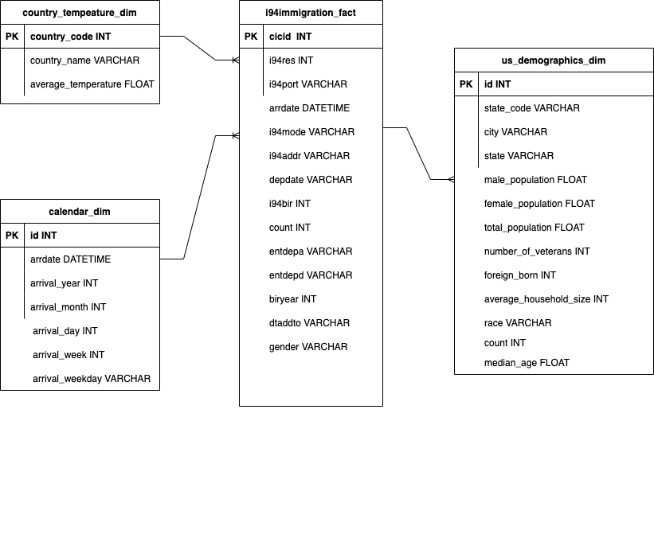

# Project Title
### Data Engineering Capstone Project

#### Project Summary
The purpose of this project is to create an data modeling for US immigration by creating ETL pipeline for `I94 immigration`, `global land temperatures` and `US demographics` datasets. With this data modeling (analytics database), data analysts can further deep dive into to find out insights which will helps to understand underlying patterns of US immigration. 

The project follows the follow steps:
* Step 1: Scope the Project and Gather Data
* Step 2: Explore and Assess the Data
* Step 3: Define the Data Model
* Step 4: Run ETL to Model the Data
* Step 5: Complete Project Write Up

### Step 1: Scope the Project and Gather Data

#### Scope 
In this project, I will use Apache Spark to do data analysis which include below actions:
- Data preprocessing and exploring for `I94 immigration` dataset
- Data preprocessing and exploring for `us-cities-demographic` dataset
- Data preprocessing and exploring for `global temperature` dataset
- Create `dimension` tables
- Create `fact` table

#### Describe and Gather Data 
There will be 3 datasets using in this project.
- **I94 Immigration Data**: This data comes from the US National Tourism and Trade Office which non-U.S, citizens from overseas countries and Mexico (traveling by air and sea) must complete an I-94 form to enter the United States. These forms are recorded into I94 Immigration dataset.
You can access the immigration data in a folder with the following path: `../../data/18-83510-I94-Data-2016/`.
- **World Temperature Data**: This dataset came from Kaggle. You can read more about this [here](https://www.kaggle.com/datasets/berkeleyearth/climate-change-earth-surface-temperature-data).
You can access the temperature data in a folder with the following path: `../../data2/`. There's just one file in that folder, called `GlobalLandTemperaturesByCity.csv`
- **U.S. City Demographic Data**: This data comes from OpenSoft. You can read more about it [here](https://public.opendatasoft.com/explore/dataset/us-cities-demographics/export/).

### Step 3: Define the Data Model
#### 3.1 Conceptual Data Model
The conceptual data model is as image below.
We have 1 fact table as `i94immigration_fact` and 3 dimension table as `country_temperature_dim`, `calendar_dim` and `us_demographics_dim`.
These dimension tables can link to fact table through `i94res`, `arrdate` and `i94addr` fields in `i94immigration_fact` table.
With this database, data analysit can deep dive to figure out patterns for immigration data, such as there is any commonality between residence country and US country state - are they prefer some specific US states over other US state.

#### Step 5: Complete Project Write Up
* Clearly state the rationale for the choice of tools and technologies for the project.
    - This project uses `Apache Spark` as it is the right choice to handle big datasets.
* Propose how often the data should be updated and why.
    - The data should be updated monthly as we will have new dataset for every month.
* Write a description of how you would approach the problem differently under the following scenarios:
 * The data was increased by 100x.
     - Currently we just using Spark in local mode, if the data increased by 100x - moving the Spark processing to `Amazon EMR` will be an optimal choice as it supports scaling.
 * The data populates a dashboard that must be updated on a daily basis by 7am every day.
     - We can apply `Apache Airflow` to handle schedule update.
 * The database needed to be accessed by 100+ people.
     - We can move our analytics database to `Amazon Redshift` which support scaling.
